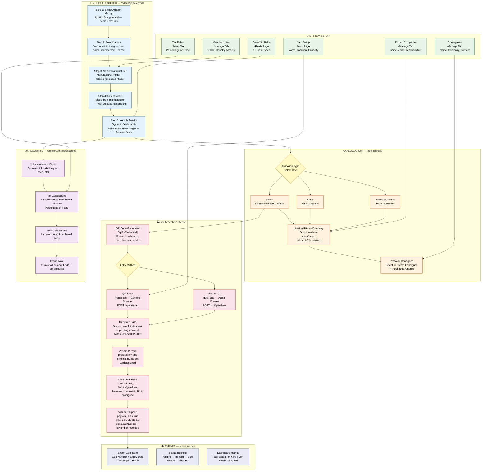

# Admin Portal - Complete Implementation

## ✅ What Has Been Implemented

### 1. **Admin Portal Structure**
- Created `/admin` folder with proper hierarchy
- Moved all management pages under admin structure
- Implemented consistent layout across all admin pages

### 2. **Navigation System**
- **Reusable Navbar Component** (`components/admin/Navbar.jsx`)
  - Logo and branding
  - Navigation links (Dashboard, Vehicles, Fields, Users)
  - Notifications bell with badge
  - User profile dropdown menu
  - Mobile responsive hamburger menu
  - Active route highlighting
  - Smooth transitions and animations

### 3. **Dashboard** (`/admin`)
- Statistics cards showing:
  - Total Vehicles (with live count)
  - Dynamic Fields count
  - Total Users
  - Recent Activity
- Quick Actions section with shortcuts to:
  - Add New Vehicle
  - Manage Fields
  - View All Vehicles
- Recent Activity feed

### 4. **Vehicle Management** (`/admin/vehicles`)
- **List View Features:**
  - Grid and List view toggle
  - Search functionality
  - Vehicle cards with images
  - View Details button
  
- **Vehicle Details Modal:**
  - Image slider with navigation arrows
  - Thumbnail strip for quick navigation
  - Image counter (e.g., "3 / 7")
  - Shows ALL images from all image fields
  - Complete vehicle information display
  - Edit button (ready for implementation)
  - Close with ESC key or click outside

- **Add Vehicle Page** (`/admin/vehicles/add`)
  - Dynamic form based on configured fields
  - Multiple file upload support
  - Image preview
  - File management (add/remove)
  - Form validation

### 5. **Dynamic Fields Management** (`/admin/fields`)
- Create custom form fields
- Configure field types:
  - text, number, boolean
  - password, email, date
  - file, image
- Assign fields to specific forms
- Set required/optional
- View all existing fields
- Delete fields

### 6. **Users Management** (`/admin/users`)
- User list table with:
  - User avatar
  - Name and email
  - Role badges
  - Status indicators
  - Last login time
  - Edit/Delete actions

- **Add New User Modal:**
  - Opens setupUser page in modal
  - Full user registration form
  - Account details
  - Personal information
  - Company information
  - Address fields
  - Role selection
  - File uploads
  - Drag & drop support
  - Paste screenshots (Ctrl+V)
  - Close with ESC or Close button

## 📁 New Folder Structure

```
app/
├── admin/                          # Admin Portal
│   ├── layout.js                   # Admin layout with navbar
│   ├── page.jsx                    # Dashboard
│   ├── vehicles/
│   │   ├── page.jsx               # Vehicle list
│   │   └── add/
│   │       └── page.jsx           # Add vehicle form
│   ├── fields/
│   │   └── page.jsx               # Dynamic fields management
│   └── users/
│       └── page.jsx               # Users management with modal
├── api/                            # API routes (unchanged)
├── login/                          # Login page
├── setupUser/                      # User setup form
└── page.js                         # Root (redirects to /admin)

components/
└── admin/
    └── Navbar.jsx                  # Reusable navbar
```

## 🔗 Routes

### Public Routes
- `/login` - User login
- `/setupUser` - User registration form

### Admin Routes (Protected)
- `/admin` - Dashboard
- `/admin/vehicles` - Vehicle list
- `/admin/vehicles/add` - Add new vehicle
- `/admin/fields` - Dynamic fields
- `/admin/users` - User management

## 🎨 Design Features

### Consistent Styling
- **Color Scheme:**
  - Primary: Blue (#3B82F6)
  - Secondary: Purple/Pink gradients
  - Success: Green
  - Error: Red
  - Neutral: Gray scale

- **Components:**
  - Rounded corners (rounded-xl, rounded-2xl)
  - Shadows (shadow-sm, shadow-lg)
  - Smooth transitions
  - Hover effects with scale transforms
  - Gradient backgrounds
  - Border highlights on active states

### Responsive Design
- Mobile-first approach
- Breakpoints: sm, md, lg
- Hamburger menu for mobile
- Grid layouts adapt to screen size
- Touch-friendly buttons and controls

## 🚀 Key Features

### Vehicle Details Modal
- **Image Slider:**
  - Navigate with arrow buttons
  - Click thumbnails to jump to image
  - Shows image counter
  - Smooth transitions
  - Responsive design

- **Information Display:**
  - All vehicle fields shown
  - Organized in cards
  - Empty states handled
  - File list with thumbnails

### Add User Modal
- **Integration:**
  - Opens setupUser page in modal
  - Maintains admin context
  - Close with ESC key
  - Click outside to close
  - Smooth animations

- **Form Features:**
  - Multiple sections (Account, Personal, Company, Address)
  - Role selection dropdown
  - Checkbox preferences
  - File upload with drag & drop
  - Paste screenshot support
  - File preview with thumbnails
  - Dynamic fields support

### Navigation
- **Active State:**
  - Highlights current page
  - Blue background for active link
  - Works with nested routes

- **User Menu:**
  - Profile dropdown
  - Settings link
  - Logout option
  - User info display

## 📝 Migration Summary

### Old → New Routes
- `/vehclemanagement` → `/admin/vehicles`
- `/vehclemanagement/add-vehicles` → `/admin/vehicles/add`
- `/fields` → `/admin/fields`
- Root `/` → Redirects to `/admin` (if authenticated)

### Cleaned Up
- ✅ Removed old `/vehclemanagement` folder
- ✅ Removed old `/fields` folder
- ✅ Updated all internal links
- ✅ Maintained API routes (no changes needed)

## 🔧 Technical Implementation

### Components
1. **Navbar** - Reusable across all admin pages
2. **AdminLayout** - Wraps all admin pages with navbar
3. **VehicleDetailsModal** - Shows vehicle details with image slider
4. **AddUserModal** - Embeds setupUser page in modal
5. **VehicleGrid** - Grid view for vehicles
6. **VehicleList** - List view for vehicles

### State Management
- React hooks (useState, useEffect)
- Local state for modals
- API calls for data fetching
- Form state management

### API Integration
- `/api/vehicles` - GET (list), POST (create)
- `/api/fields` - GET (list), POST (filter by form)
- `/api/createUser` - POST (create user)
- `/api/newField` - POST (create field)

## 🎯 User Flow

1. **Login** → User visits `/login`
2. **Redirect** → After login, redirects to `/admin` dashboard
3. **Dashboard** → View statistics and quick actions
4. **Navigation** → Use navbar to access different sections
5. **Vehicles** → View, search, and manage vehicles
6. **Add Vehicle** → Click "Add New Vehicle" → Fill form → Submit
7. **View Details** → Click "View Details" → See all images and info
8. **Fields** → Configure dynamic form fields
9. **Users** → Manage users, click "Add New User" → Modal opens
10. **Add User** → Fill form in modal → Submit → Modal closes

## ✨ Highlights

### Image Slider
- Shows ALL uploaded images
- Smooth navigation
- Thumbnail preview
- Keyboard support (arrows)
- Touch/swipe ready

### Modal System
- Backdrop overlay
- Click outside to close
- ESC key to close
- Smooth animations
- Prevents body scroll
- Responsive sizing

### Form System
- Dynamic field generation
- File upload with preview
- Drag & drop support
- Validation
- Error handling
- Success messages

## 📱 Mobile Experience
- Responsive navbar with hamburger menu
- Touch-friendly buttons
- Optimized layouts for small screens
- Swipeable image slider
- Mobile-optimized modals

## 🔐 Security Notes
- Routes should be protected with authentication middleware
- Role-based access control recommended
- File upload validation needed
- Input sanitization required
- CSRF protection recommended

## 🚧 Future Enhancements
- [ ] Add authentication middleware
- [ ] Implement role-based permissions
- [ ] Real-time notifications
- [ ] User profile editing
- [ ] Vehicle editing functionality
- [ ] Bulk operations
- [ ] Export/Import data
- [ ] Activity logging
- [ ] Reports and analytics
- [ ] Email notifications
- [ ] Advanced search filters
- [ ] Pagination for large datasets

---

## System Workflow Diagram



### Color Legend

| Color | Meaning | Phase |
|-------|---------|-------|
| 🟢 Green | System Setup | Manufacturer, Rikuso, Consignee, Fields, Tax, Yard configs |
| 🔵 Blue | Vehicle Addition | 5-step wizard (Group → Venue → Maker → Model → Details) |
| 🟠 Orange | Allocation | Export/Khitai/Resale + Rikuso assignment + Presold |
| 🔴 Red | Yard Operations | QR scan, IGP/OGP gate passes, vehicle tracking |
| 🔵 Indigo | Export | Certificate management, status tracking, dashboard |
| 🟣 Purple | Accounts | Dynamic accounting fields, tax/sum calculations, grand total |

### Key Model Relationships

| Model | Relationship | Used In |
|-------|-------------|---------|
| `Vehicle` (strict: false) | Core entity — stores all dynamic fields | All phases |
| `Manufacturer` | Dual-purpose: car manufacturer OR Rikuso company (`isRikusoCompany` flag) | Setup, Allocation |
| `Consignee` | Presold buyer with `purchasedAmount` and `label` | Allocation, Yard, Export |
| `GatePass` | IGP/OGP records linking Vehicle ↔ Yard | Yard, Export |
| `DynFeilds` | Field definitions with `belongsto` scoping | Vehicle Addition, Accounts |
| `Tax` | Tax rules (percentage or fixed) linked to dynamic fields | Accounts |
| `AuctionGroup` | Contains venues as nested `options[]` | Vehicle Addition |
